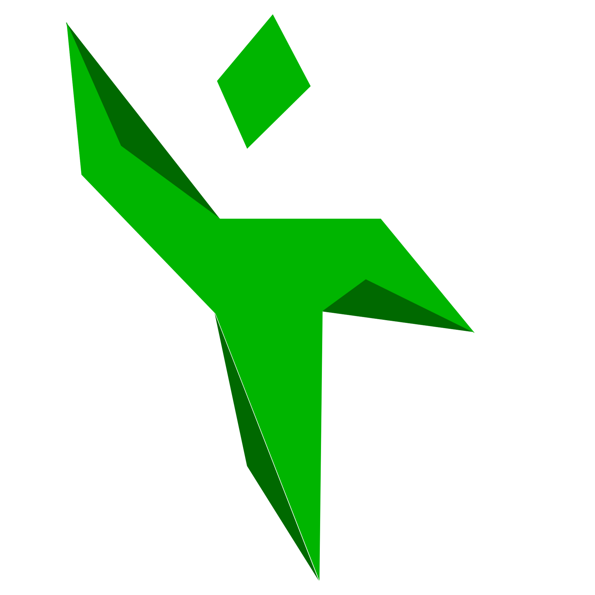

# Проект по обработке DICOM-файлов


### Данный проект разработан для работы с медицинскими данными в формате DICOM. Он включает в себя скрипты и утилиты, которые обеспечивают преобразование, сортировку и анализ данных, а также создание и обучение классификатора для определения модальности снимков и частей тела, изображенных на них.

## Описание исходной модели

- Поддерживаются .jpg изображения с тремя каналами RGB и следующие модальности и части тела: КТ головного мозга, брюшной полости и грудной клетки, Рентген кисти, брюшной полости и грудной клетки
- Однако, вы можете обучить модель на основе своих данных, все инструменты (за исключением создания .csv файла с перечнем данных и их атрибутами) представлены в приложении.

## Структура проекта

+ Classifier app.spec: Файл с настройками для упаковки и дистрибуции приложения
+ requirements.txt: Файл со всеми необходимыми для приложения Python-библиотеками
+ project/: Директория со скриптами и обработанными данными для приложения и самим приложением
   + app.py: Python-файл с исходным кодом приложения и его внешним видом
   + venv: Виртуальное окружение Python (в случае использования)
   + resources: Директория с изображениями, используемые при упаковке приложения и внутри него самого
   + app/: Директория со скриптами и обработанными данными для приложения
      + checkpoints: Папка с сохраненными контрольными точками модели
      + logs: Журналы и логи модели
      + classifier.py: Скрипт с классификацией изображений на основе обученной модели
      + bin/: Директория с основными скриптами для обработки данных
         + dicom_refactor.py: Скрипт с конвертацией dicom-файлов в .jpg изображение
         + sort.py: Скрипт с сортировкой dicom-файлов по модальности и частям тела на основе метаданных
         + classifier/: Корневая директория модели
            + dataset.py: Скрипт для считывания атрибутов из .csv файлов и создания наборов данных
            + jpg_rgb_refactor.py: Скрипт для конвертации изображений в .jpg-формат с тремя каналами RGB (можно выбирать одно из двух, или сразу обе опции)
            + model.py: Скрипт, содержащий конфигурацию модели классификатора
            + model_test.py: Скрипт для тестирования модели
            + split_data.py: Скрипт для создания train.csv и val.csv из .csv файла с наименованиями и атрибутами файлов для обучения
            + train.py: Основной скрипт, отвечающий за обучение модели
            + train.csv: Файл, созданный split_data.py, содержащий пути и атрибуты случайных 80% исходных изображений для обучения
            + val.csv: Файл, созданный split_data.py, содержащий пути и атрибуты оставшихся 20% исходных изображений для обучения

## Инструкции по мануальному обучению (через терминал)

1. Сортировка DICOM файлов: Если вы хотите сортировать DICOM файлы по метаданным (например, Modality или BodyPartExamined), вы можете использовать sort.py. Он сортирует файлы в соответствующие поддиректории внутри начальной директории. Запустите его следующим образом:
```python sort.py [путь к начальной директории] [y или n]```
   - y: Выполняет сортировку всех файлов по модальности и частям тела.
   - n: Сортирует файлы только по модальности.

2. Предобработка DICOM файлов: Для предобработки DICOM файлов, вы можете использовать dicom_refactor.py. Он конвертирует DICOM файлы в изображения формата JPEG и сохраняет их в поддиректории /img. Запустите его следующим образом:
```python dicom_refactor.py [путь к директории с DICOM файлами]```
3. Преобразование изображений в RGB: Если вы хотите преобразовать изображения в формат RGB, вы можете использовать jpg_rgb_refactor.py. Он выполняет эту операцию и сохраняет обновленные файлы в той же директории. Вы можете запустить его следующим образом:
```python jpg_rgb_refactor.py [путь к директории с изображениями] [0 или 1 или 2]```
   - 0: Только конвертация в формат JPEG.
   - 1: Только конвертация в формат RGB.
   - 2: Оба шага (JPEG и RGB).

4. Подготовка данных для обучения модели: Перед тем, как начать обучение модели по распознаванию модальности и частей тела снимков, следует разбить данные на обучающие и тестирующие, используя split_data.py. Этот скрипт создает файлы train.csv и val.csv, содержащие названия изображений, их модальность и части тела. Однако берется эта информация из заранее созданного пользователем .csv файла с расставленными метками. Вы можете запустить его следующим образом:
```python split_data.py [путь к начальной директории с изображениями] [путь к рабочей директории, куда будут сохранены файлы train.csv и val.csv] [путь к .csv файлу, содержащего информацию об изображениях]```
5. Обучение модели: Если вы подготовили всё необходимое для обучения модели, используйте train.py. Этот скрипт использует все вами ранее подготовленные данные для обучения классификатора изображений. Вы можете запустить его следующим образом:
```python split_data.py [путь к директории с изображениями] [путь к train.py] [путь, где будут располагаться точки сохранения модели после обучения] [использовать центральный процессор для обучения - "cpu", использовать графический процессор для обучения - "cuda"] [количество эпох обучения (больше эпох = большее время обучения и увеличенная точность)] [количество единовременно загруженных в память изображений (меньше размер батча = большее время обучения и увеличенная точность)] [количество процессов, параллельно генерирующих пакеты (больше параллельных процессов = меньше времени на обучение и большая нагрузка на процессор)]```

## Рекомендации по окружению

- Создайте виртуальное окружение Python для изоляции зависимостей проекта
- Установите все необходимые библиотеки, выполнив в терминале команду ```python3 -m pip install -r requirements.txt```
- В случае, если вы хотите воссоздать процесс сборки приложения (или же изменить его), можете выполнить в терминале следующий перечень команд:
   - ```python -m venv venv```
   - ```source venv/bin/activate``` (или ```venv\Scripts\activate``` для Windows)
   - ```pip install -r requirements.txt```

## Требования

- Python 3.11.xx
- Библиотеки Python, указанные в requirements.txt
- В случае, если обучение модели не происходит с использованием CUDA, однако конфигурация вашей системы соответствует требованиям, советуем использовать команду ```pip install torch==1.7.0 -f https://download.pytorch.org/whl/torch_stable.html```